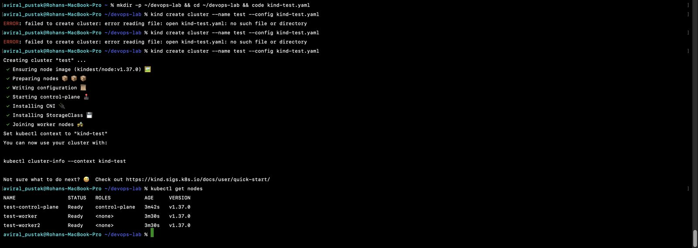

# Project 00: Workstation Set-up

**Real-World DevOps Projects** · Part 0 of 20 · Rohan Aviral

Before the first project, the machine has to be ready: every tool installed, Docker sized for local Kubernetes, and a multi-node cluster proven to work. This repo records how I set it up on an Intel MacBook, what went wrong, and how I worked around it.

📄 Full write-up with screenshots: [docs/Day_00_Workstation_Setup.pdf](docs/Day_00_Workstation_Setup.pdf)
➡️ Next: Project 01, Linux Ops Toolkit (coming soon)

---

## Repository structure

```
devops-project-00-workstation-setup/
├── scripts/check-tools.sh     # prints OK / MISSING for every tool in the series
├── configs/kind-test.yaml     # three-node kind cluster (1 control plane, 2 workers)
├── notes/day-00.md            # working notes: problems hit and fixes
└── docs/
    ├── Day_00_Workstation_Setup.pdf
    └── screenshots/
```

## The tool set

| Tool | Purpose | Installed with |
|---|---|---|
| git, docker, kubectl, minikube, terraform, aws, python3, node, npm, jq, make | Already present | - |
| kind | Multi-node Kubernetes inside Docker | Homebrew |
| helm | Kubernetes packaging | Homebrew |
| yq | YAML on the command line | Homebrew |
| trivy | Image vulnerability scanning | Homebrew |
| hadolint | Dockerfile linting | Homebrew |
| tflint | Terraform linting | GitHub release binary |
| localstack, awslocal | Local AWS simulator | pip |
| ansible | Configuration management | pip |

## Quick start

```bash
git clone https://github.com/Aviral-Rohan/devops-project-00-workstation-setup.git
cd devops-project-00-workstation-setup

./scripts/check-tools.sh                      # what is installed?

kind create cluster --name test --config configs/kind-test.yaml
kubectl get nodes                             # 3 nodes, all Ready
kind delete cluster --name test
```



## Problems I hit

| # | Problem | Cause | Fix |
|---|---|---|---|
| 1 | `No available formula with the name "tflint"`, and nothing else installed | One unknown name stops the whole `brew install` command | Removed it from the list; installed tflint from its GitHub release |
| 2 | `brew install yq ansible` heading for hours of compiling (pandoc, LLVM, Rust) | Homebrew no longer ships ready-made bottles for Intel Macs | Let the quick ones finish, stopped at ansible with Ctrl + C, installed ansible with pip in about a minute |
| 3 | `command not found: localstack` right after a successful install | pip installed to `~/Library/Python/3.14/bin`, which was not on `PATH` | Added it to `PATH` in `~/.zshrc` |
| 4 | Docs example pinned Kubernetes v1.16.4 (2019) | The example was written to show version pinning | Removed the `image:` lines so kind uses its tested default |
| 5 | `no such file or directory` for the kind config | File open in VS Code but never saved | Saved it (the white dot on the tab means unsaved) |

After clean-up, `brew autoremove && brew cleanup --prune=all` freed 13.6 GB of build tools.

## What I learned

- On an Intel Mac, prefer release binaries, pip or Docker images over Homebrew for tools that would compile from source.
- "Command not found" straight after an install is usually a `PATH` problem. Read the installer's warnings.
- "No such file or directory": run `ls` and `pwd` before retrying.
- Before copying an example from documentation, check which lines you need and look at any version numbers.

## Series

| # | Project | Status |
|---|---|---|
| 00 | Workstation Set-up | ✅ Done |
| 01 | Linux Ops Toolkit | Next |
| 02-20 | Git workflow, Docker, CI/CD, Terraform, Kubernetes, GitOps, monitoring, AWS, Ansible, DevSecOps, capstone | Planned |

## License

MIT
